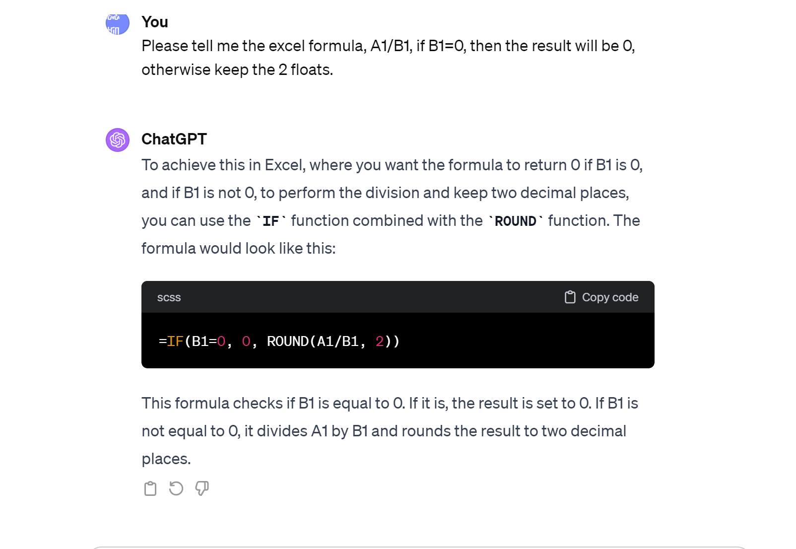

# excel-challenge-new
## New Attempt

### 1. Given the provided data, what are three conclusions that we can draw about crowdfunding campaigns?

From the three pivot charts, we can observe some interesting findings: 
* Among the various categories, Theater, Music, and Film & Video are the top three categories in which people commonly launch campaigns. Within these, the plays subcategory under Theater is the most popular, accounting for 344 out of the total 1000 campaigns—representing 34.4% of all sub-category initiatives. This indicates that the Theater category, particularly plays, is a highly competitive field for starting campaigns.

* Nevertheless, initiating campaigns in the Theater, Music, and Film & Video categories does not necessarily ensure a high success rate. Each of these categories has a success rate hovering around 50%. In contrast, Technology and Journalism categories exhibit considerably higher success rates, at 67% and 100%, respectively.

* The data also suggests a seasonal pattern in campaign performance, with certain months—such as March, June, and July—experiencing a higher volume of campaigns. Moreover, the success rate varies throughout the year; for instance, April and May tend to have higher success rates compared to months like February and September.

### 2. What are some limitations of this dataset?

A critical piece of information missing from this dataset is the duration of each campaign. Without details on how long each campaign was active, we cannot fully understand their outcomes. Campaign length could significantly impact success rates, as longer campaigns may have a greater opportunity to meet their goals, or conversely, they may face a higher risk of cancellation.

### 3. What are some other possible tables and/or graphs that we could create, and what additional value would they provide?

* I would like to have a line chart plotting the success rate of campaigns over years, showing the trends that the longer the campaingns last, the more successful rates they might have achieved. 

* I would also establish a line chart plotting the number of backers of each campaign could give insight into the relationship between the number of backers and the success of a campaingn. 

### Bugs and information reference:
1. when I tried to establish a formula to calculate pledge per becker, I don't know how to make it. Therefore I got the solution and explanation from ChatGPT, and eventually I learnt it. 

